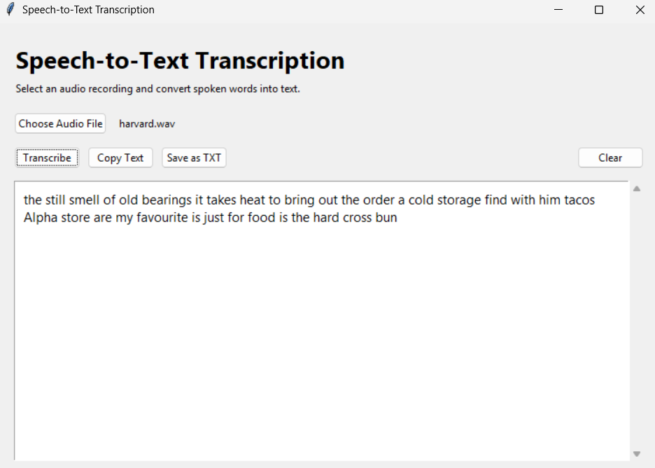

# Speech-to-Text Transcription

A simple Python desktop tool that converts an audio recording into editable
text. It uses Python's built-in Tkinter library for the interface and the
`SpeechRecognition` library for transcription.

## Application Screenshot



## Features

- Select WAV, AIFF, or FLAC audio recordings
- Convert speech to text with Google Web Speech recognition
- Edit and copy the transcription
- Save the result as a `.txt` file
- Friendly progress and error messages

## Requirements

- Python 3.10 or newer
- An internet connection while transcribing
- A clear WAV, AIFF, or FLAC recording

## Installation

Open PowerShell in this folder and create a virtual environment:

```powershell
python -m venv .venv
.\.venv\Scripts\Activate.ps1
python -m pip install -r requirements.txt
```

## Run the application

```powershell
python app.py
```

Then:

1. Click **Choose Audio File**.
2. Select a WAV, AIFF, or FLAC recording.
3. Click **Transcribe**.
4. Copy, edit, or save the resulting text.

## How it works

1. `tkinter` displays the desktop interface and file picker.
2. `SpeechRecognition` reads the selected audio file.
3. Google Web Speech recognition converts the audio into text.
4. A background thread keeps the interface responsive during transcription.

## Limitations

- Google Web Speech recognition requires an internet connection.
- Background noise, low volume, and overlapping speakers may reduce accuracy.
- MP3 is not read directly. Convert MP3 recordings to WAV or FLAC first.
- Very long recordings may take time or exceed the free service's limits.
